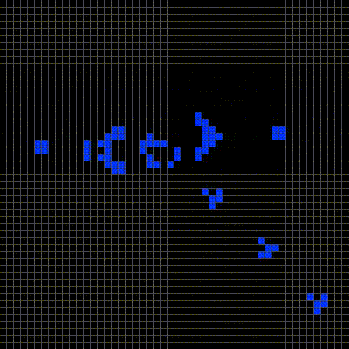

# Conway's Game of Life #

The Game of Life is a cellular automata created by John Horton Conway. Displayed within a grid, each cell is defined by its state, live or dead. The cells are updated according to the following rules:
- Any live cell with fewer than two live neighbours dies, as if by underpopulation.
- Any live cell with two or three live neighbours lives on to the next generation.
- Any live cell with more than three live neighbours dies, as if by overpopulation.
- Any dead cell with exactly three live neighbours becomes a live cell, as if by reproduction.

With just these simple rules, given certain simple enough looking initial
conditions, great complexity can arise.

# To build and run this project: #

From a command prompt in the `game_of_life` directory, run the following commands:
1. `mkdir build`
2. `cd build`
3. `cmake ..`
4. `make all`
5. `./game_of_life`

To build project using VS Code, navigate to the `game_of_life` directory:
1. From a command prompt, run `code .`
2. Press <kbd>Ctrl</kbd> + <kbd>Shift</kbd> + <kbd>X</kbd> to open the Extensions panel.
3. Ensure that CMake Tools by Microsoft is installed. (ms-vscode.cmake-tools)
4. Press <kbd>Ctrl</kbd> + <kbd>Shift</kbd> + <kbd>P</kbd> and type `cmake build`

# grid.h
## Public methods
- `bool get_cell(int row, int col)`
    - returns true if there is a live cell at (row, col)
- `void set_cell(int row, int col, bool is_alive)`
    - sets the state of the cell at (row, col) to `is_alive`
- `void update()`
    - increments the grid by one tick and updates the board
- `void prev_state()`
    - restores the state of the grid to the previous tick
- `void clear()`
    - clears the board of any live cells

## Private methods
- `int count_neighbors(int row, col)`
    - returns the number cells that are alive and adjacent to (row, col)
- `bool in_bounds(int row, col)`
    - returns true if (row, col) is within the bounds of the grid

## Private members
- `bool* bit_array`
    - pointer to the boolean array storing the values of the grid
- `std::vector<bool*> prev_states`
    - vector storing all previous states of the grid

# Use

- Clicking on a square on the grid toggles its state
- <kbd>space</kbd> toggles the flow of time
- <kbd>⬆</kbd> or <kbd>K</kbd> or <kbd>W</kbd> doubles the rate of time
- <kbd>⬇</kbd> or <kbd>J</kbd> or <kbd>S</kbd> halfs the rate of time
- <kbd>N</kbd> increments time step by one
- <kbd>P</kbd> decrements time step by one
- <kbd>C</kbd> clears the grid of any live cells
- <kbd>ESC</kbd> exits the program

 
 
 
 
 
 

# Acknowledgements
- Ths project was started using the template found at https://github.com/juliettef/GLFW-CMake-starter.
